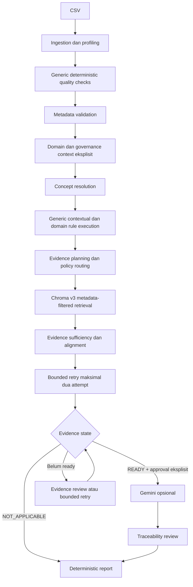

# MetaGuard

> **MetaGuard v0.3.5** — sistem *deterministic-first* untuk review kualitas data, konteks domain, dan evidence kebijakan lokal.

## 1. Tentang MetaGuard

MetaGuard membantu pengguna meninjau kualitas teknis dan kontekstual dataset CSV, menghubungkan hasil pemeriksaan dengan evidence kebijakan lokal yang relevan, lalu—bila seluruh guard terpenuhi—menyediakan interpretasi Gemini yang terbatas dan dapat ditelusuri.

Fokus utama MetaGuard adalah auditabilitas: temuan teknis berasal dari pemeriksaan deterministik berbasis Pandas dan rule registry. RAG/Chroma menyediakan konteks evidence kebijakan, sedangkan Gemini hanya berperan untuk menginterpretasi, merangkum, dan memberi rekomendasi dari state deterministik serta evidence yang telah divalidasi.

MetaGuard **bukan** chatbot umum, sistem sertifikasi legal/compliance, pengambil keputusan otonom, sistem perbaikan CSV otomatis, maupun platform enterprise siap produksi. Project ini dikembangkan sebagai prototype/research-coursework untuk review awal kualitas data.

## 2. Fitur Utama

- Ingestion CSV dengan konfigurasi parsing, diagnostics, serta mode analisis `exact`, `chunked`, dan `sampled`.
- Profiling dataset, pemeriksaan kualitas deterministik, dan quality score.
- Validasi metadata dan pemeriksaan kontekstual generik.
- Pilihan domain dan governance context yang eksplisit; tidak ada deteksi domain otomatis oleh LLM.
- Semantic Concept Registry untuk resolusi nama kolom melalui alias exact-normalized.
- Domain Rule Registry dengan provenance, resolved columns, dan kebutuhan human review.
- Policy Registry, corpus kebijakan lokal v3, Chroma metadata-filtered retrieval, serta manifest/fingerprint corpus.
- Routing evidence deterministik, assessment sufficiency/alignment, dan retry retrieval yang dibatasi maksimal dua attempt per evidence need.
- Orchestrator berbasis state dan allowlist action, bukan autonomous agent loop.
- Gemini opsional setelah evidence siap dan approval manusia eksplisit.
- Validasi citation deterministik dan laporan JSON schema `1.1` dengan metadata/provenance v3.

## 3. Domain dan Governance Context

Domain dipilih pengguna secara eksplisit dan disimpan sebagai `DomainId` yang stabil:

| Domain ID | Fungsi |
| --- | --- |
| `generic` | Pemeriksaan generik tanpa rule pack sektoral. |
| `healthcare` | Mengaktifkan `healthcare_core`. |
| `education` | Mengaktifkan `education_core`. |
| `environment` | Mengaktifkan `environment_core`. |
| `other` | Pemeriksaan generik untuk konteks di luar profil yang tersedia. |

Governance context independen dari domain:

| Governance context | Arti operasional |
| --- | --- |
| `government_public` | Evidence kebijakan pemerintah yang eligible dapat dirutekan sesuai evidence need. |
| `generic_non_government` | Kebijakan pemerintah tidak dirutekan otomatis. |

Domain tidak diinfer dari nama kolom, dan governance context tidak diinfer dari domain. Untuk `generic` atau `other`, rule sektoral tidak berjalan. Untuk `generic_non_government`, seluruh evidence need pemerintah dapat berstatus `NOT_APPLICABLE`; ini bukan kegagalan retrieval dan workflow deterministik dapat selesai tanpa approval atau Gemini.

## 4. Arsitektur Sistem



Analysis context memiliki fingerprint SHA-256 deterministik dari domain, governance context, serta fingerprint concept/rule/policy registry. Dataset fingerprint dan analysis-context fingerprint dipakai untuk mencegah state downstream yang sudah stale, termasuk evidence, approval, Gemini result, traceability, dan report.

## 5. Deterministic-First Design

Prinsip desain MetaGuard adalah sebagai berikut.

1. **Temuan teknis authoritative.** Quality checker, metadata validator, contextual validation, dan domain rule engine menghasilkan finding deterministik.
2. **LLM bukan sumber finding.** Gemini tidak boleh membuat finding teknis baru, mengubah severity/count/percentage deterministik, atau memperkuat wording yang masih bersifat ketidakpastian.
3. **Evidence bukan bukti kepatuhan.** Policy evidence adalah konteks pendukung; evidence readiness dan sufficiency merupakan heuristic MetaGuard, bukan kesimpulan hukum.
4. **Provenance eksplisit.** Rule memiliki provenance seperti `DETERMINISTIC_INVARIANT` atau `HEURISTIC`; provenance tidak berubah hanya karena ada policy chunk yang berhasil diambil.
5. **Human review tetap diperlukan.** Finding heuristic, policy interpretation, dan hasil Gemini tidak menggantikan penilaian manusia.

Pemisahan ini membuat setiap hasil review memiliki jalur provenance yang sesuai. Finding deterministik dapat ditelusuri ke checker/rule, konsep, dan kolom sumber, sedangkan interpretasi Gemini dapat ditelusuri ke evidence dan citation yang diberikan kepadanya.

## 6. Generic Quality Checks

`core/quality_checker.py` menyediakan pemeriksaan deterministik berikut:

- missing values;
- whitespace dan empty strings pada kolom teks;
- variasi kategori yang tinggi;
- duplicate identifier;
- invalid date dan inconsistent date format pada kolom yang terdeteksi sebagai tanggal;
- negative numeric (dengan pengecualian nama koordinat yang dikenal);
- percentage di luar rentang 0–100;
- numeric outlier berbasis IQR;
- constant column dan empty column;
- duplicate rows dan duplicate column names.

Quality score dihitung terpisah dari finding. Nilai outlier, tanggal, duplicate identifier, dan temuan statistik lain adalah sinyal verifikasi; temuan tersebut tidak otomatis menyatakan data salah atau tidak patuh.

## 7. Domain Rule Packs

Rule berikut berasal dari `data/rule_registry.json`. Semua rule bekerja melalui `concept_id` dan actual resolved source columns, bukan melalui satu nama kolom CSV yang di-hard-code.

| Domain / pack | Rule ID | Tujuan ringkas | Provenance | Human review |
| --- | --- | --- | --- | --- |
| Healthcare / `healthcare_core` | `HEALTH-BED-CAPACITY-001` | Tempat tidur terisi tidak melebihi kapasitas rawat inap. | `DETERMINISTIC_INVARIANT` | Ya |
| Healthcare / `healthcare_core` | `HEALTH-INTERNET-BANDWIDTH-001` | Status tanpa internet dengan bandwidth positif berpotensi tidak konsisten. | `HEURISTIC` | Ya |
| Education / `education_core` | `EDU-STUDENT-TEACHER-001` | Siswa positif dengan guru nol berpotensi tidak konsisten. | `HEURISTIC` | Ya |
| Education / `education_core` | `EDU-STUDENT-CLASSROOM-001` | Siswa positif dengan kelas nol berpotensi tidak konsisten. | `HEURISTIC` | Ya |
| Environment / `environment_core` | `ENV-SENSOR-MEASUREMENT-001` | Sensor offline/nonaktif dengan pengukuran numerik pada baris sama berpotensi tidak konsisten. | `HEURISTIC` | Ya |

Education dan environment adalah pilot rule pack konservatif. Rule heuristic bukan standar regulasi, bukan threshold legal, dan tidak memiliki `policy_requirement`. Missing atau ambiguous concept menghasilkan state skip yang eksplisit, bukan keberhasilan palsu.

## 8. Policy Evidence dan RAG

Policy registry adalah sumber kebenaran corpus. Corpus v3 disimpan terpisah dalam collection Chroma `metaguard_policies_v3`, menggunakan embedding lokal `sentence-transformers/all-MiniLM-L6-v2`, chunk ID deterministik, metadata scalar yang kompatibel dengan Chroma, manifest persisted, dan fingerprint corpus.

Corpus v3 baseline memuat enam dokumen kebijakan yang telah diverifikasi untuk corpus lokal proyek:

- `GOV-SDI-PERPRES-39-2019`;
- `BPS-STANDARD-DATA-4-2020`;
- `BPS-METADATA-5-2020`;
- `HEALTH-SATU-DATA-18-2022`;
- `EDU-SATU-DATA-31-2022`;
- `ENV-SATU-DATA-25-2021`.

Evidence need yang tervalidasi adalah:

- `metadata_governance`;
- `data_quality`;
- `accountability`;
- `domain_semantic_support`;
- `technical_standard_support`.

Router hanya menerima context/domain/evidence need yang tervalidasi dan menghasilkan policy pack, policy ID, serta metadata filter yang aman. Ia tidak menerima raw Chroma filter, tidak melakukan query rewriting oleh LLM, dan tidak memakai fallback lintas-domain.

### Applicability dan retrieval state

| State | Makna |
| --- | --- |
| `APPLICABLE` | Ada policy eligible yang dapat dirutekan untuk context dan evidence need. |
| `NOT_APPLICABLE` | Evidence kebijakan tidak tepat diterapkan untuk context tersebut; bukan retrieval failure. |
| `NO_ELIGIBLE_POLICY` | Context/need valid, tetapi registry tidak menyediakan policy eligible. |
| `SUCCESS` | Retrieval v3 mengembalikan evidence eligible. |
| `EMPTY` | Retrieval applicable, tetapi tidak menghasilkan chunk. |
| `CORPUS_STALE` | Manifest/collection/corpus tidak current dan memerlukan rebuild eksplisit. |

Sufficiency menilai coverage, evidence unik, dan source diversity secara deterministik. Alignment policy pack dan domain dinilai terpisah. Evidence duplikat tidak meningkatkan score. Bila applicable evidence belum siap, retry deterministik dapat dilakukan paling banyak satu kali setelah retrieval pertama; tidak ada retry tanpa batas.

## 9. Agentic Review Workflow

Orchestrator MetaGuard memakai stage dan action yang dibatasi secara statis, bukan agent yang bebas memanggil tool arbitrary.

```text
INGESTION_REQUIRED
QUALITY_REQUIRED
METADATA_REQUIRED
CONTEXTUAL_VALIDATION_REQUIRED
EVIDENCE_REQUIRED
EVIDENCE_REVIEW_REQUIRED
ANALYSIS_READY
TRACEABILITY_REQUIRED
REPORT_REQUIRED
COMPLETE
ERROR
```

Contoh action yang diizinkan mencakup quality pipeline, metadata validation, contextual validation, retrieval/evaluasi/retry evidence, Gemini analysis, traceability review, dan build report. Stage `COMPLETE` untuk seluruh evidence need `NOT_APPLICABLE` berarti workflow deterministik sudah selesai; status tersebut tidak menyatakan dataset valid atau compliant.

## 10. Gemini Integration

Gemini bersifat opsional dan hanya dapat dieksekusi bila seluruh kondisi berikut terpenuhi:

1. evidence workflow v3 ready untuk review;
2. ada policy evidence eligible yang disanitasi dan dibatasi;
3. pengguna memberikan approval eksplisit; dan
4. analysis state/fingerprint belum berubah.

Satu analysis state yang tidak berubah dibatasi maksimal satu panggilan Gemini. Gemini menerima deterministic findings, metadata/context yang relevan, contextual/domain execution state, dan policy evidence bounded. Sanitizer membatasi evidence Gemini ke maksimal lima item dan string evidence ke 300 karakter tanpa menghapus identity `chunk_id`, `source`, atau `page`.

Gemini tidak boleh menghasilkan verdict legal/compliance, memanggil retrieval, memperbaiki CSV, membuat rule baru, atau menciptakan finding teknis authoritative.

## 11. Traceability

Setiap citation Gemini diperiksa secara deterministik terhadap evidence yang benar-benar diberikan ke Gemini. Identity evidence memuat setidaknya:

- `chunk_id`;
- `source`;
- `page`;
- `policy_id`;
- `policy_pack`;
- `domain_id`; dan
- `document_type`.

Citation dengan `chunk_id` yang tidak supplied atau tidak eligible dinilai invalid, meskipun source/page tampak serupa. Summary traceability menyimpan jumlah citation total, valid, invalid, dan persentase traceability.

Traceability membuktikan hubungan citation ke evidence yang tersedia; ia **tidak** menjamin interpretasi Gemini benar secara faktual, legal, atau kontekstual.

## 12. Laporan JSON

`core/report_builder.py` menghasilkan report dengan `schema_version` `1.1`. Report tetap dapat dibangun tanpa Gemini dan secara additive memuat `v3_metadata`, termasuk:

- analysis context dan registry fingerprints;
- domain rule execution serta rule provenance;
- policy evidence bounded yang eligible;
- summary per evidence need, sufficiency, dan alignment;
- evidence readiness, human approval, Gemini execution, dan traceability;
- limitations resmi MetaGuard.

Finding deterministik tidak ditulis ulang oleh Gemini. Report tidak menyertakan PDF mentah, embedding vector, API key, raw session state, atau DataFrame penuh.

## 13. Instalasi

Contoh berikut untuk Windows PowerShell.

```powershell
python -m venv .venv
.\.venv\Scripts\Activate.ps1
python -m pip install -r requirements.txt
Copy-Item .env.example .env
```

`.env.example` menyediakan konfigurasi lokal. Isi `GEMINI_API_KEY` bila ingin memakai Gemini; `GEMINI_MODEL` juga wajib tersedia saat Gemini dieksekusi. Jangan commit file `.env` atau API key nyata.

Project menggunakan dependency utama: Streamlit, Pandas, Chroma, Sentence Transformers, pypdf, Google Gen AI, dan pytest. Chroma dipertahankan kompatibel dengan baseline local `0.6.3`.

## 14. Menjalankan Aplikasi

Jalankan dari root repository:

```powershell
.\.venv\Scripts\python.exe -m streamlit run app.py
```

Streamlit akan menampilkan URL lokal di terminal (umumnya `http://localhost:8501`). Pilih domain serta konteks tata kelola sebelum menjalankan alur analisis.

## 15. Menjalankan Test

```powershell
.\.venv\Scripts\python.exe -m pytest -q
.\.venv\Scripts\python.exe -m compileall app.py core llm rag tests scripts
```

Baseline release v0.3.5: **364 passed** dengan **137 warning**. Warning yang diketahui berasal dari deprecation/compatibility Pydantic yang dipancarkan dependency Chroma pada test contract/ingestion/retrieval; warning tersebut bukan kegagalan test aplikasi.

## 16. Struktur Repository

```text
.
├── app.py                 # UI Streamlit dan integrasi workflow terkontrol
├── core/                  # ingestion, validation, registries, agent, evidence, report
├── rag/                   # PDF loading, chunking, corpus v3, Chroma retrieval
├── llm/                   # client dan schema Gemini terstruktur
├── data/                  # concept, rule, policy registry dan PDF kebijakan lokal
├── scripts/               # utilitas eksplisit, termasuk build corpus v3
├── tests/                 # unit, contract, integration, acceptance, dan Streamlit tests
├── docs/                  # dokumentasi arsitektur, testing, dan release
├── requirements.txt
├── .env.example
└── README.md
```

Artifact runtime seperti `vector_db/`, cache, `.env`, dan `__pycache__` diabaikan oleh Git. Corpus v3 tidak dibangun otomatis pada import atau rerun aplikasi; rebuild adalah tindakan maintenance eksplisit melalui `scripts/build_policy_corpus_v3.py`.

## 17. Manual Acceptance / Validation Matrix

Manual acceptance workflow utama pada baseline v0.3.5:

| Skenario | Status | Cakupan utama |
| --- | --- | --- |
| Healthcare + Government/Public | PASS | `healthcare_core`, evidence healthcare, approval/traceability. |
| Education + Government/Public | PASS | `education_core` pilot heuristic dan isolasi domain. |
| Environment + Government/Public | PASS | `environment_core` pilot heuristic dan isolasi domain. |
| Generic + Government/Public | PASS | pemeriksaan generik serta evidence governance yang eligible. |
| Generic + Non-Government | PASS | seluruh evidence pemerintah `NOT_APPLICABLE`, tanpa policy retrieval yang applicable dan tanpa Gemini. |

Matrix ini adalah acceptance teknis/manual terhadap alur prototype; bukan sertifikasi formal, qualification produksi, atau pengujian kepatuhan hukum.

## 18. Known Limitations

- MetaGuard adalah prototype/research-coursework, bukan platform production-ready.
- Duplicate identifier checker memakai heuristic nama kolom. Entity/reference identifier pada data relasional atau time-series—misalnya `id_sensor` yang berulang untuk banyak pengukuran—dapat valid tetapi masih berpotensi ditandai sebagai duplicate identifier. Penyempurnaan jangka panjang memerlukan pembedaan semantik record key dan entity reference secara eksplisit.
- Numeric outlier berbasis IQR adalah sinyal statistik untuk verifikasi, bukan bukti nilai otomatis invalid.
- Rule domain `HEURISTIC` memerlukan human review. Tidak adanya finding tidak membuktikan domain valid.
- Corpus baseline terbatas pada enam policy yang terdaftar dan telah diverifikasi dalam corpus lokal proyek; tidak ada discovery kebijakan web otomatis saat runtime.
- Evidence sufficiency/alignment adalah heuristic MetaGuard, bukan legal sufficiency, jaminan relevansi penuh, atau compliance score.
- Contextual validation dan parsing tanggal sengaja konservatif dan cakupannya terbatas.
- Mode `chunked` masih menggabungkan data untuk pemeriksaan global; ini bukan pemrosesan true out-of-core. Finding pada mode `sampled` hanya berlaku untuk sampel.
- Gemini membutuhkan API key dan jaringan, tetapi tidak wajib untuk membangun report deterministik.
- MetaGuard tidak melakukan automatic CSV repair.

## 19. Release Status

Current final technical baseline: **v0.3.5**.

Perkembangan singkat: v0.1 membangun prototype awal, v0.2 memperkenalkan controlled agentic workflow, v0.3 menambahkan arsitektur domain-aware dan policy-grounded, sedangkan v0.3.5 memfinalkan semantics terminal untuk evidence yang seluruhnya `NOT_APPLICABLE`.

## 20. Disclaimer

MetaGuard adalah alat bantu review kualitas data. Semua hasil memerlukan penilaian manusia. Policy evidence bukan sertifikasi kepatuhan, dan Gemini bukan pengambil keputusan final.
