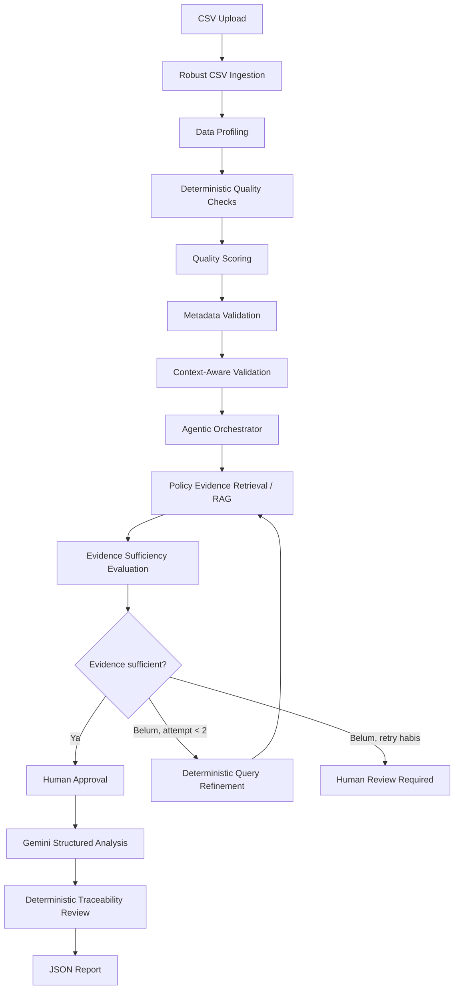

# MetaGuard

MetaGuard v0.3 release candidate adalah *Domain-Aware Policy-Grounded Data
Quality Review System* untuk validasi awal dataset OPD/pemerintah daerah.

MetaGuard memadukan validation deterministik, konteks domain dan tata kelola
eksplisit, policy-grounded retrieval lokal, orchestrator berbatas, Gemini dengan
persetujuan manusia, dan traceability deterministik. MetaGuard bukan chatbot umum atau pengambil
keputusan otonom. Temuan teknis utama selalu berasal dari aturan deterministik;
Gemini hanya menyusun interpretasi dan rekomendasi dari hasil serta evidence
yang tersedia.

## Tujuan

MetaGuard membantu pemeriksaan awal kualitas dataset, kelengkapan metadata,
potensi inkonsistensi konteks, dan evidence kebijakan sebelum publikasi atau
verifikasi lanjutan. MetaGuard bukan mesin penetapan kepatuhan hukum, bukan
pengganti auditor, dan bukan platform produksi pemerintah.

## Fitur utama

- Ingestion satu CSV dengan deteksi/override encoding, delimiter, quote
  character, dan penanganan baris malformed.
- Diagnostics header asli/terurai, duplicate header, unnamed column, warning
  parsing, dan scope analisis.
- Mode `exact`, `chunked`, dan `sampled` dengan reservoir sampling
  deterministik.
- Profil dataset, quality checks deterministik, dan quality score proporsional.
- Validasi kelengkapan metadata serta contextual validation.
- Profil domain eksplisit: `generic`, `healthcare`, `education`,
  `environment`, dan `other`; governance context: `government_public` atau
  `generic_non_government`.
- Rule healthcare, serta pilot heuristic konservatif untuk education dan
  environment; domain tidak diinfer otomatis dari kolom CSV.
- Registry konsep/rule/policy, corpus kebijakan v3 enam dokumen terverifikasi,
  routing deterministik, metadata-filtered retrieval, evidence sufficiency dan
  alignment, serta bounded retry maksimal dua attempt per evidence need.
- Controlled agentic orchestration dengan tool allowlist dan audit ringan.
- Analisis Gemini terstruktur setelah persetujuan manusia eksplisit.
- Evidence traceability deterministik dan laporan JSON.

Tidak tersedia autentikasi, database pengguna/riwayat, deployment, web search,
koreksi CSV otomatis, atau pemrosesan *true out-of-core*.

## Arsitektur



`MAX_RETRIEVAL_ATTEMPTS` adalah `2`: retrieval awal dan paling banyak satu
retry dengan refinement deterministik. Tidak ada loop tanpa batas atau Gemini
query rewriting.

## Prinsip desain

1. **Deterministic-first** — finding teknis dibuat oleh rule lokal berbasis
   Pandas, bukan LLM.
2. **Policy-grounded** — RAG menyediakan evidence kebijakan, bukan keputusan
   kepatuhan.
3. **Bounded agentic workflow** — satu orchestrator memilih action dari state
   kecil yang terkontrol.
4. **Human-in-the-loop** — Gemini membutuhkan approval eksplisit pengguna.
5. **Auditable dan traceable** — keputusan agent dicatat ringkas dan citation
   Gemini dibandingkan terhadap evidence retrieval.
6. **No automatic legal conclusion** — seluruh hasil tetap memerlukan review
   manusia serta sumber data resmi.

## Workflow agentic

Planner deterministik menggunakan stage:

`INGESTION_REQUIRED` → `QUALITY_REQUIRED` → `METADATA_REQUIRED` →
`CONTEXTUAL_VALIDATION_REQUIRED` → `EVIDENCE_REQUIRED` →
`EVIDENCE_REVIEW_REQUIRED` → `ANALYSIS_READY` →
`TRACEABILITY_REQUIRED` → `REPORT_REQUIRED` → `COMPLETE`.

Stage `ERROR` menangani kegagalan prasyarat/tool. Hasil kosong tidak disamakan
dengan proses yang belum berjalan: zero findings dapat berarti quality check
selesai, sedangkan zero evidence dapat berarti retrieval selesai tetapi tidak
menemukan evidence.

Action agent berasal dari allowlist internal untuk quality pipeline, metadata,
contextual validation, retrieval/evaluasi/retry evidence, Gemini, traceability,
dan report. Tidak ada `eval`, `exec`, shell command, atau Python arbitrer dari
input pengguna.

## Evidence sufficiency dan retrieval retry

Evidence sufficiency adalah **heuristic kecukupan evidence retrieval
MetaGuard**, bukan legal sufficiency, compliance score, jaminan relevansi
semantik, atau correctness score. Komponen skornya adalah coverage evidence
need, jumlah evidence unik, source diversity, dan pengabaian duplikat.

Heuristik internal saat ini: `SUFFICIENT_THRESHOLD=85`,
`PARTIAL_THRESHOLD=40`, dan minimum dua evidence unik untuk `sufficient`.
Evidence retry bersifat kumulatif dan dideduplikasi konservatif berdasarkan
`chunk_id`, atau source/page/text bila `chunk_id` tidak ada. Jika coverage tidak
dapat diperbaiki secara deterministik atau retry habis, Gemini diblokir dan
human review diperlukan.

## Contextual validation

Contextual validation adalah pemeriksaan pendahuluan deterministik yang dapat
memerlukan review domain/manusia:

- konsistensi tahun `data_period` metadata dengan kolom tanggal;
- cakupan wilayah pada level administratif yang kompatibel;
- `tempat_tidur_terisi <= kapasitas_rawat_inap` untuk profile `healthcare`;
- status internet eksplisit tanpa koneksi versus `bandwidth_mbps > 0`.

Tidak ada fuzzy geographic matching, external geocoder, atau basis data wilayah
eksternal. Kolom kode wilayah tidak dianggap nama wilayah tanpa mapping
eksplisit. `kecamatan` tidak dinilai mismatch terhadap metadata `kabupaten`
tanpa mapping hierarki eksplisit.

Koordinat negatif valid tidak dilaporkan sebagai `negative_numeric` bila nama
kolom, setelah normalisasi exact, adalah `latitude`, `longitude`, `lat`, `lon`,
atau `lng`. Belum ada generalized coordinate-range validation.

## Analysis modes

| Mode | Scope efektif | Strategi memori | Catatan |
| --- | --- | --- | --- |
| `exact` | `full` | `single_dataframe` | Seluruh file dimuat sekali. |
| `chunked` | `full` | `combined_dataframe` | Dibaca bertahap lalu tetap digabung ke memori untuk pemeriksaan global; bukan *true out-of-core*. |
| `sampled`, sample < total | `sampled` | `reservoir_sample` | Reservoir sampling deterministik; finding hanya berlaku pada sampel. |
| `sampled`, sample >= total | `full` | `reservoir_sample` | Seluruh baris dianalisis; `sampling_applied=false`. |

Default `CsvReadConfig`: `chunk_size=50000`, `sample_size=10000`, dan
`sample_seed=42`. Finding sampled tidak diekstrapolasi menjadi estimasi populasi.

## Scoring

Skor dimulai dari 100. Penalti tiap finding adalah:

```text
penalty = severity_weight × (0.15 + 0.85 × sqrt(clamp(percentage, 0, 100) / 100))
```

Bobot: `high=12`, `medium=6`, `low=2`, `info=0`; total penalti dibatasi 100.
Grade: `Sangat Baik` (≥90), `Baik` (≥75), `Perlu Perbaikan` (≥60), dan
`Bermasalah` (<60).

## Policy documents

Knowledge base lokal mencakup:

- `data/policies/PeraturanBPSNo5-Tahun2020-Metadata.pdf`
- `data/policies/PerpresNo39-Tahun2019-SatuData.pdf`

Dokumen `.txt` dan `.pdf` di `data/policies/` dapat di-ingest tanpa OCR.
Bangun ulang Chroma vector store lokal dengan:

```powershell
python -m rag.ingest
```

Vector store berada pada `vector_db/`, collection `metaguard_policies`, dan
embedding model `sentence-transformers/all-MiniLM-L6-v2`. Dokumen tersebut
tidak menjadikan MetaGuard penetap legal compliance.

## Instalasi

```powershell
python -m venv .venv
.\.venv\Scripts\Activate.ps1
python -m pip install -r requirements.txt
```

## Environment

Salin `.env.example` menjadi `.env`, lalu isi `GEMINI_API_KEY` bila akan
menjalankan Gemini. Contoh environment juga memuat `GEMINI_MODEL`,
`LLM_PROVIDER`, `EMBEDDING_MODEL`, dan `VECTOR_DB_PATH`. Jangan commit `.env`
atau key nyata.

```powershell
Copy-Item .env.example .env
```

## Menjalankan aplikasi dan test

```powershell
python -m streamlit run app.py
python -m pytest -q
python -m compileall app.py core llm rag tests
```

## Struktur repository

```text
app.py                 # UI Streamlit dan orkestrasi ringan
core/                  # ingestion, validation, scoring, agent, report
rag/                   # loader, chunking, Chroma store, retrieval, ingest
llm/                   # client Gemini terstruktur
data/policies/         # dokumen kebijakan lokal
tests/                 # unit, integration, acceptance, dan AppTest
docs/                  # testing, arsitektur, dan release preparation
```

## Output

Laporan JSON `schema_version` `1.1` memuat source, profile, quality summary,
findings, score, metadata dan validasinya, contextual validation, policy
evidence, evidence sufficiency, retrieval attempts, Gemini analysis, evidence
review, ingestion diagnostics, serta `v3_metadata` untuk analysis context,
provenance rule, evidence-need state, approval, Gemini, traceability, dan
limitations. Field v0.2 tetap tersedia secara backward-compatible.

## Limitations

- Research/coursework prototype, bukan production-ready system.
- Rule education dan environment adalah pilot `HEURISTIC` yang membutuhkan
  human review; absence of finding bukan kesimpulan domain valid.
- Evidence sufficiency adalah heuristic retrieval, bukan legal/compliance score.
- Policy evidence memberi konteks pendukung dari corpus terdaftar/current dan
  terverifikasi; readiness evidence bukan kepatuhan atau validitas hukum.
- Gemini opsional, hanya setelah readiness evidence dan approval eksplisit,
  maksimal satu call untuk analysis state yang tidak berubah; temuan
  deterministik tetap authoritative. Tidak ada AI-generated repair atau rule.
- Chroma distance belum dipakai untuk sufficiency.
- Contextual rules terbatas; geographic matching sengaja konservatif.
- Parser tanggal quality checker menerima format terbatas.
- Finding sampled bersifat sample-specific; chunked memakai `combined_dataframe`.
- Gemini memerlukan API key dan network; retrieval bergantung pada knowledge
  base lokal yang sudah di-ingest.
- Human review tetap diperlukan untuk data, konteks domain, evidence, dan
  interpretasi kebijakan.

## Originalitas

MetaGuard adalah implementasi original. DesignGuard dan Agentic-DesignGuard
hanya menjadi referensi konseptual, bukan sumber code, prompt, struktur folder,
UI, atau format laporan MetaGuard.
