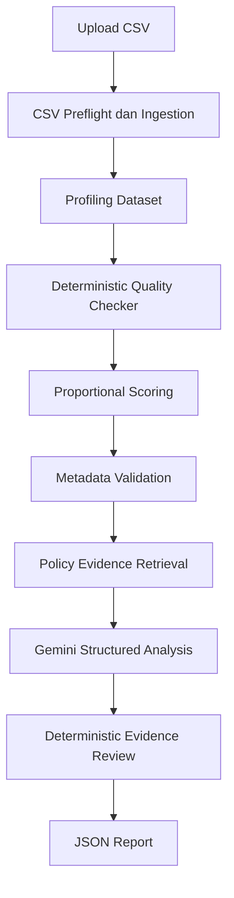

# MetaGuard

MetaGuard adalah prototipe penelitian untuk validasi awal kualitas dataset OPD secara lokal dan deterministik, yang dilengkapi validasi metadata, retrieval evidence kebijakan, analisis terstruktur menggunakan Gemini, dan pemeriksaan traceability referensi.

Temuan teknis berasal dari aturan kualitas data yang deterministik. RAG hanya menyediakan evidence kebijakan; Gemini menyusun interpretasi dan rekomendasi dari payload yang diberikan, bukan menjadi sumber temuan teknis. Hasil MetaGuard bukan keputusan hukum. MetaGuard saat ini adalah *functional research prototype*, bukan sistem produksi.

## 1. Gambaran Umum

Sebelum publikasi, dataset OPD dapat memuat nilai kosong, baris duplikat, identifier yang tidak unik, nilai numerik negatif, persentase di luar rentang, tanggal tidak valid atau berformat tidak konsisten, whitespace, variasi kategori, serta outlier. Berkas CSV juga dapat memiliki header duplikat, kolom tanpa nama, atau baris malformed. Selain kualitas data, metadata yang tidak lengkap dan laporan tanpa evidence yang dapat ditelusuri menyulitkan pemeriksaan awal.

MetaGuard membantu pengelola data melakukan validasi awal yang transparan sebelum publikasi atau pemeriksaan lanjutan oleh pengelola data. Aplikasi tidak membersihkan, melewati, atau mengoreksi data sumber secara diam-diam.

## 2. Fitur Utama

- Unggah tepat satu file CSV.
- Konfigurasi encoding dan delimiter otomatis atau manual, quote character, serta penanganan baris malformed.
- Tiga mode analisis: `exact`, `chunked`, dan `sampled`.
- Konfigurasi `chunk_size`, `sample_size`, dan `sample_seed` sesuai mode aktif.
- Diagnostics ingestion terstruktur, termasuk encoding, delimiter, header, warning parsing, dan scope analisis.
- Profil dataset JSON-safe.
- Pemeriksaan kualitas data deterministik.
- Quality scoring proporsional berbasis severity dan persentase dampak.
- Form metadata dan validasi kelengkapan metadata.
- Retrieval evidence kebijakan dari knowledge base lokal.
- Analisis terstruktur Gemini setelah evidence kebijakan tersedia.
- Review traceability deterministik untuk referensi `chunk_id`, `source`, dan `page` dari Gemini.
- Unduh laporan JSON.
- Reset state evidence, analisis Gemini, review traceability, dan report payload ketika file, metadata, atau konfigurasi parsing aktif berubah.

Fitur seperti autentikasi, penyimpanan pengguna, dashboard histori, database laporan, multi-user, API produksi, koreksi data otomatis, dan pemrosesan *true out-of-core* belum tersedia.

## 3. Prinsip Desain

### Deterministic-first

Temuan teknis dibuat oleh pemeriksaan lokal berbasis aturan dan Pandas, meliputi nilai kosong, string kosong, whitespace, variasi kategori, kolom konstan atau kosong, baris duplikat, nama kolom duplikat, identifier duplikat, nilai negatif, persentase di luar 0--100, tanggal invalid atau tidak konsisten, dan outlier numerik berbasis IQR.

### Evidence-grounded analysis

Gemini menerima profil ringkas, finding deterministik, metadata, validasi metadata, context ingestion, dan policy evidence. Gemini tidak boleh mengubah nilai finding, membuat finding teknis baru, atau menyebut evidence yang tidak tersedia.

### Traceability

Referensi Gemini diperiksa secara deterministik terhadap `chunk_id`, `source`, dan `page` pada policy evidence. Evidence reviewer tidak membuat panggilan LLM kedua.

### Local-first processing

CSV dibaca, diprofilkan, dan diperiksa secara lokal. Retrieval memakai vector store Chroma lokal pada `vector_db/`. Namun, ketika pengguna menjalankan fitur Gemini, payload analisis dikirim ke API eksternal Gemini.

### No legal conclusion

MetaGuard tidak menentukan kepatuhan hukum dan tidak menggantikan verifikasi manusia maupun sumber data resmi.

## 4. Arsitektur Sistem



Gemini hanya dapat dijalankan setelah policy evidence tersedia. Satu proses analisis menggunakan maksimum satu panggilan Gemini. Evidence reviewer tidak melakukan panggilan LLM kedua.

## 5. Struktur Repository

```text
.
├── app.py
├── core/
│   ├── csv_ingestion.py
│   ├── csv_reader.py
│   ├── data_profiler.py
│   ├── quality_checker.py
│   ├── scoring.py
│   ├── metadata_validator.py
│   ├── policy_evidence.py
│   ├── evidence_reviewer.py
│   ├── evidence_sanitizer.py
│   ├── analysis_state.py
│   └── report_builder.py
├── llm/
│   └── gemini_client.py
├── rag/
│   ├── document_loader.py
│   ├── chunker.py
│   ├── vector_store.py
│   ├── retriever.py
│   └── ingest.py
├── data/
│   └── policies/
├── vector_db/
├── tests/
├── docs/
│   └── testing-v0.1.md
├── .env.example
├── .gitignore
├── AGENTS.md
├── requirements.txt
└── README.md
```

Repository ini tidak memiliki `pytest.ini`; pytest menggunakan discovery bawaan.

## 6. CSV Ingestion dan Mode Analisis

`CsvReadConfig` menyediakan default berikut: `chunk_size=50000`, `sample_size=10000`, dan `sample_seed=42`. Token missing default adalah `""`, `NA`, `N/A`, `NULL`, `null`, `None`, dan `-`.

Preflight mendeteksi encoding, delimiter, quote character, estimasi jumlah kolom, header asli, header duplikat, kolom tanpa nama, inkonsistensi jumlah field, dan contoh terbatas baris malformed. Delimiter yang didukung untuk deteksi otomatis adalah koma, titik koma, tab, dan pipe. Encoding otomatis mencoba `utf-8-sig`, `utf-8`, `cp1252`, lalu `latin-1`; fallback dicatat sebagai warning.

| Mode | Scope | Strategi memori | Keterangan |
| --- | --- | --- | --- |
| `exact` | `full` | `single_dataframe` | Seluruh file dimuat sekali. |
| `chunked` | `full` | `combined_dataframe` | File dibaca bertahap, lalu seluruh chunk tetap digabung dalam memori untuk pemeriksaan global. Ini belum *true out-of-core*. |
| `sampled` dengan sample lebih kecil dari total | `sampled` | `reservoir_sample` | Reservoir sampling deterministik memakai seed. |
| `sampled` dengan sample sama/lebih besar dari total | `full` | `reservoir_sample` | Mode pilihan tetap `sampled`, tetapi seluruh baris dianalisis dan `sampling_applied` bernilai `false`. |

Diagnostics ingestion memuat, antara lain, `status`, `mode`, `analysis_scope`, `memory_strategy`, `encoding`, `delimiter`, `quote_character`, `rows_loaded`, `total_rows`, `columns_loaded`, `malformed_rows`, `rows_skipped`, `original_headers`, `parsed_headers`, dan `warnings`. Mode chunked menambahkan `chunk_size_requested`. Mode sampled menambahkan `sampling_method`, `sample_size_requested`, `sample_seed`, `sampled_rows`, dan `sampling_applied`.

## 7. Metadata, Skor, dan Laporan

Metadata yang divalidasi: `title`, `description`, `producer_opd`, `data_period`, `geographic_scope`, `measurement_unit`, `update_frequency`, `responsible_unit`, dan `publication_purpose`. Skor kelengkapan merupakan proporsi field wajib yang terisi, dengan status `Lengkap` (>=90), `Cukup Lengkap` (>=70), atau `Belum Lengkap`.

Skor kualitas data dimulai dari 100. Penalti tiap finding dihitung dengan rumus berikut:

```text
penalty = severity_weight × (0.15 + 0.85 × sqrt(clamp(percentage, 0, 100) / 100))
```

Bobot severity: `high=12`, `medium=6`, `low=2`, dan `info=0`. Total penalti dibatasi sampai 100. Grade: `Sangat Baik` (>=90), `Baik` (>=75), `Perlu Perbaikan` (>=60), dan `Bermasalah` (<60).

Laporan JSON memiliki `schema_version` `1.0` dan mencakup `source`, `profile`, `quality_summary`, `findings`, `score`, `metadata`, `metadata_validation`, `policy_evidence`, `gemini_analysis`, `evidence_review`, dan `ingestion`. Evidence finding dibatasi hingga lima item; string evidence dipotong setelah 300 karakter dan diberi penanda `...[dipotong]`.

## 8. Knowledge Base Kebijakan

Letakkan dokumen `.txt` atau `.pdf` pada `data/policies/`. TXT dibaca sebagai UTF-8; PDF diekstrak per halaman tanpa OCR. Ingestion melakukan normalisasi teks, chunking, filtering chunk tidak bermakna, deduplikasi exact-normalized, embedding lokal, dan penyimpanan persistent ke Chroma.

Jalankan pembangunan ulang knowledge base:

```powershell
python -m rag.ingest
```

Vector store lokal berada di `vector_db/`, collection bernama `metaguard_policies`, dan model embedding adalah `sentence-transformers/all-MiniLM-L6-v2`.

Contoh retrieval evidence:

```python
from rag.retriever import retrieve_policy_chunks

results = retrieve_policy_chunks(
    "metadata statistik yang harus disediakan",
    top_k=3,
)
```

Retrieval hanya mengembalikan evidence; tidak menghasilkan jawaban generatif.

## 9. Instalasi dan Menjalankan Aplikasi

Gunakan environment Python yang kompatibel dengan dependency pada `requirements.txt`.

```powershell
python -m venv .venv
.\.venv\Scripts\python.exe -m pip install -r requirements.txt
```

Salin `.env.example` menjadi `.env` untuk memakai Gemini. `llm/gemini_client.py` membaca `GEMINI_API_KEY` dan `GEMINI_MODEL`. Jangan menyimpan API key dalam repository.

```powershell
Copy-Item .env.example .env
.\.venv\Scripts\python.exe -m streamlit run app.py
```

Jika knowledge base belum dibangun, jalankan `python -m rag.ingest` sebelum menekan tombol retrieval evidence pada aplikasi.

## 10. Pengujian

Lihat [catatan pengujian v0.1](docs/testing-v0.1.md) untuk cakupan automated test, prosedur manual, dan batasannya.

Jalankan seluruh automated test:

```powershell
python -m pytest
python -m compileall app.py core llm rag tests
git diff --check
```

## 11. Keterbatasan v0.1

- Mode chunked belum merupakan pemrosesan out-of-core; seluruh chunk digabung ke memori.
- Sampled analysis tidak boleh dibaca sebagai hasil exact ketika `analysis_scope` bernilai `sampled`.
- PDF tanpa teks yang dapat diekstrak tidak didukung karena tidak ada OCR.
- Retrieval bergantung pada knowledge base lokal yang sudah di-ingest.
- Gemini memerlukan API key, model yang dikonfigurasi, koneksi internet, dan evidence kebijakan; fitur ini mengirim payload ke layanan eksternal.
- Tidak ada koreksi otomatis terhadap data sumber.

## Originalitas

MetaGuard dikembangkan sebagai implementasi original. DesignGuard dan Agentic-DesignGuard hanya digunakan sebagai referensi konseptual dan tidak menjadi sumber code, prompt, struktur folder, UI, maupun format laporan MetaGuard.
