# MetaGuard v0.2 Architecture

## System goals

MetaGuard menyediakan review awal kualitas dataset yang dapat ditelusuri.
Technical findings dibuat deterministik, evidence kebijakan diperoleh dari
knowledge base lokal, dan Gemini hanya menyusun analisis setelah prasyarat
terpenuhi.

## Design constraints

- Pengembangan lokal ringan untuk laptop dual-core.
- Deterministic-first untuk technical findings.
- Satu controlled orchestrator, bukan multi-agent swarm.
- Bounded retrieval retry tanpa loop otonom.
- Persetujuan manusia eksplisit sebelum Gemini.
- Tidak ada automatic legal/compliance conclusion atau koreksi data otomatis.

## Component diagram

```mermaid
flowchart LR
    UI[Streamlit UI] --> ING[CSV ingestion and diagnostics]
    ING --> DET[Profile quality score]
    DET --> META[Metadata and contextual validation]
    META --> AGENT[Deterministic agent planner]
    AGENT --> RAG[Local policy RAG]
    RAG --> SUFF[Evidence sufficiency]
    SUFF -->|sufficient + approval| GEM[Gemini]
    GEM --> TRACE[Traceability reviewer]
    TRACE --> REPORT[JSON report]
```



## Pipeline

CSV preflight/parsing menghasilkan DataFrame dan diagnostics. Profiling,
quality checker, scoring, metadata, serta contextual validation berjalan lokal.
Agent membangun state kecil dan memilih action allowlisted. Retrieval mengambil
evidence kebijakan; sufficiency dapat meminta satu retry deterministik. Gemini
berjalan sekali setelah status `sufficient` dan approval. Traceability reviewer
memeriksa citation sebelum report dibangun.

## Agent state model

`AgentState` adalah dataclass immutable dan JSON-safe. Ia menyimpan marker
completion, count, status, scope, retry metadata, fingerprint, dan blocking
condition; bukan DataFrame, raw CSV, API key, full Gemini payload, atau full
policy text.

Completion dibedakan dari nilai hasil: zero findings bukan berarti belum
checked; zero evidence bukan berarti retrieval belum run; traceability selesai
bukan otomatis `valid`; report selesai berarti payload tersedia, bukan browser
telah mengunduh file.

## Deterministic tool layer

Registry statis memetakan action ke wrapper tipis: quality pipeline, metadata,
contextual validation, retrieval, evidence evaluation/retry, Gemini,
traceability, dan report. Tidak ada dynamic import, `eval`, `exec`, arbitrary
shell command, atau arbitrary Python execution.

## State and fingerprint

Fingerprint mengikat nama/isi CSV, metadata, dan konfigurasi parsing aktif.
Perubahan input aktif menghapus evidence, sufficiency, retry history, Gemini,
traceability, report, serta state/audit agent. Rerun dengan fingerprint sama
mempertahankan state dan tidak otomatis menjalankan external tools.

## Evidence lifecycle

```text
evidence need → retrieval → conservative deduplication → sufficiency
→ optional bounded refinement retry → human-approved Gemini → traceability
```

Sufficiency adalah pemeriksaan pra-Gemini atas coverage, evidence unik, dan
source diversity. Traceability adalah pemeriksaan pasca-Gemini atas `chunk_id`,
source, dan page. Keduanya berbeda dan tidak memakai LLM kedua.

## Human-in-the-loop dan failure handling

Gemini hanya valid pada `ANALYSIS_READY`, dengan evidence tersedia, sufficiency
`sufficient`, dan approval eksplisit. Failure ingestion, metadata tidak lengkap,
evidence tidak cukup, atau tool failure menghasilkan blocking condition/error
terstruktur; planner tidak boleh menyatakan `COMPLETE` setelah prasyarat gagal.

## Security boundary dan limitations

API key dibaca dari `.env`, bukan source/report. Policy documents dan vector
store lokal; `vector_db/` diabaikan Git. Audit event tidak menyimpan raw CSV,
DataFrame, key, full evidence, atau full Gemini payload. Lihat
[README](../README.md#limitations) dan [testing-v0.2](testing-v0.2.md) untuk
batasan produk dan pengujian.
