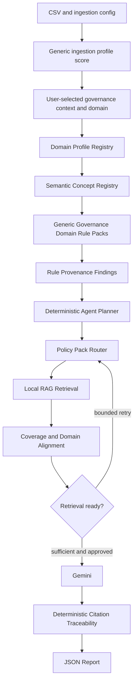

# MetaGuard v0.3 Domain Architecture Research

## Architecture intent

v0.3 extends v0.2 through deterministic registries, not a new agent framework.
The generic pipeline remains stable; governance and domain layers activate from
explicit user-selected analysis context.

## Component responsibilities

| Component | Responsibility | Boundary |
| --- | --- | --- |
| Analysis context | Stores explicit governance context and domain | No LLM inference |
| Domain profile registry | Selects active packs | Immutable data/configuration |
| Semantic concept registry | Resolves curated exact-normalized aliases | No fuzzy matching |
| Rule registry | Points to allowlisted deterministic evaluators | No executable strings |
| Provenance builder | Adds rule/domain/concept/support metadata | Does not create findings |
| Policy registry/router | Limits local retrieval scope | Does not decide legal relevance |
| Sufficiency/alignment | Evaluates retrieval readiness | Not compliance scoring |
| Agent | Coordinates registered tools/states | No arbitrary execution |
| Gemini | Interprets structured input after approval | No technical findings |
| Traceability | Verifies citation links deterministically | No second LLM |

## Profile activation and state flow

`generic` always activates generic quality. Governance activates only under
`government_public`. Domain packs activate only for the matching selected
profile. `other` activates no domain semantic pack and shows a fallback message.

Active context/profile identifiers and normalized optional configuration must
enter the existing fingerprint. Their change resets contextual/domain findings,
policy evidence, sufficiency, retry history, Gemini, traceability, report, and
agent state/audit. Same-fingerprint reruns preserve state and do not rerun tools.

## Registry model

Registries should be small, typed, JSON-safe, and loaded with application code.
They contain identifiers and allowlisted function references, never DataFrames,
raw CSV, embedding vectors, keys, or user-provided code. Composition permits
new domains without changing generic pipeline contracts.

| Domain | Generic | Governance | Domain pack |
| --- | --- | --- | --- |
| Generic | Yes | Optional | None |
| Healthcare | Yes | Yes | Existing healthcare rules |
| Education | Yes | Yes | Research-gated pilot |
| Environment | Yes | Yes | Research-gated pilot |
| Other | Yes | Optional | None |

## Policy routing and retrieval

The v0.2 collection is `metaguard_policies`, backed by local Chroma and MiniLM.
v0.3 routing should narrow by selected policy pack, domain, evidence need, and
document type. One collection with primitive metadata filtering is preferred
initially for low-resource use. Per-pack collections are a future scaling or
isolation option, not a v0.3 requirement.

## Sufficiency versus alignment

Sufficiency measures structural retrieval readiness: coverage, unique evidence,
and source diversity. Alignment is a separate metadata-based indication that the
retrieved policy pack/domain matches the selected context. Neither measure legal
status, semantic truth, regulatory applicability, or correctness.

Gemini should require appropriate routing plus sufficient retrieval readiness.
Human approval remains separate and mandatory.

## Traceability and report flow

Citation traceability expands from `Gemini reference → chunk → source/page` to
`Gemini reference → chunk → document → policy pack → evidence need → domain`.
Each available link remains deterministic. Report extensions should be additive
and preserve schema `1.0` consumers unless a future contract review proves a
schema bump necessary.

## Failure and fallback behavior

Missing aliases, unavailable packs, no matching policy pack, empty retrieval,
partial alignment, or retry exhaustion must yield visible blocked/fallback
state rather than invented conclusions. Generic analysis can continue where
valid, but domain findings and domain-policy claims remain disabled. Routing
must not silently search unrelated domain packs.
