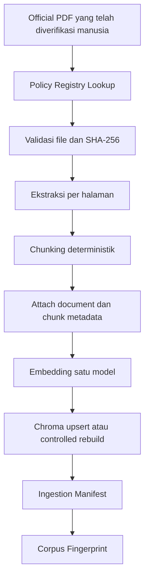

# MetaGuard v0.3 Policy Ingestion Architecture

Dokumen ini adalah rancangan implementasi, bukan bukti bahwa policy baru telah
diunduh, di-ingest, atau tersedia di vector store. Rancangan mempertahankan
batas v0.2: RAG hanya menyediakan evidence, Gemini bukan validator teknis atau
hukum, dan traceability tetap deterministik.

## 1. Baseline RAG v0.2

Alur aktual adalah:

```text
PDF/TXT lokal
-> ekstraksi per halaman
-> chunking deterministik
-> filter chunk bermakna
-> deduplikasi teks exact-normalized
-> embedding MiniLM
-> satu persistent Chroma collection
-> nearest-neighbour query
-> policy evidence
-> heuristic evidence sufficiency
-> Gemini setelah approval manusia
-> deterministic traceability review
```

Implementasi aktual menggunakan:

- `rag/document_loader.py`: TXT UTF-8 dan PDF text-extractable melalui
  `pypdf`, dengan output `source`, `page`, dan `text`;
- `rag/chunker.py`: chunk berorientasi paragraf dengan default 800 karakter,
  overlap 120, dan minimum 150 karakter;
- `rag/vector_store.py`: model
  `sentence-transformers/all-MiniLM-L6-v2`, collection statis
  `metaguard_policies`, dan persistence di `vector_db/`;
- `rag/ingest.py`: selalu rebuild collection, membaca semua PDF/TXT pada folder
  datar `data/policies/`, lalu melakukan deduplikasi selama satu run;
- `rag/retriever.py`: ranking mengikuti urutan distance dari Chroma dan
  mengembalikan `chunk_id`, `source`, `page`, `text`, dan `distance`;
- `core/policy_evidence.py`: query serta satu retry refinement yang
  deterministik dan dibatasi dua attempt;
- `core/evidence_sufficiency.py`: coverage, jumlah evidence unik, dan
  keragaman source; Chroma distance tidak digunakan;
- `core/evidence_reviewer.py`: mencocokkan citation Gemini terhadap
  `chunk_id`, `source`, dan `page`.

Metadata Chroma saat ini hanya `source` dan `page`. `chunk_id` disimpan sebagai
ID record Chroma, bukan sebagai metadata. Tidak ada policy registry, manifest,
checksum source, metadata domain/pack, atau incremental ingestion. Rebuild
menghindari duplikasi antar-run; deduplikasi exact-normalized menghindari
duplikasi teks dalam satu run. Deduplikasi global saat ini berisiko membuang
provenance apabila dua dokumen berbeda memuat teks identik.

## 2. Sasaran v0.3

Pipeline ingestion yang disarankan:



Tujuan utamanya adalah identitas policy stabil, routing berbasis metadata,
reproducibility, pencegahan accidental duplicate ingestion, dan kemampuan
menentukan kapan corpus harus dibangun ulang.

## 3. Policy Registry

### 3.1 Format yang direkomendasikan

Gunakan JSON sebagai source of truth yang dapat direview, kemudian load ke
frozen dataclass/typed model untuk validasi. Kombinasi ini sesuai dengan
codebase Python, JSON-safe, tidak memerlukan dependency YAML, dan memisahkan
data deklaratif dari kode allowlisted. Registry tidak boleh memuat expression,
import path yang dapat dipilih pengguna, `eval`, atau executable rule.

Satu database baru tidak diperlukan. Registry kecil dapat dibaca satu kali dan
di-cache berdasarkan checksum file registry.

### 3.2 Document-level metadata

Field wajib:

| Field | Fungsi |
| --- | --- |
| `policy_id` | Identitas stabil, independen dari nama file |
| `title` | Nama resmi untuk UI/report |
| `number` | Nomor instrumen sebagai string |
| `year` | Tahun integer |
| `authority` | Penerbit/otoritas terverifikasi |
| `domain_id` | Domain utama, misalnya `generic`, `healthcare` |
| `policy_pack` | Unit eligibility/routing |
| `document_type` | Governance policy, sectoral regulation, technical standard, atau reference |
| `classification` | `ESSENTIAL`, `SUPPORTING`, atau `REFERENCE_ONLY` |
| `effective_status` | Status terverifikasi; dokumen tidak current tidak eligible |
| `topics` | Daftar ID topik terkurasi |
| `routing_scope` | Default, domain, subprofile, atau topic-only |
| `local_file` | Path relatif repository yang diverifikasi |
| `verification_state` | Gate sebelum ingestion |

Field opsional:

| Field | Kapan diperlukan |
| --- | --- |
| `scope` | Ringkasan cakupan untuk manusia/router |
| `source_url` | Provenance official source; metadata saja, bukan auto-download |
| `revision_info` | Amendemen, replacement, atau revocation yang sudah diverifikasi |
| `research_notes` | Catatan non-routing untuk reviewer |

`source_url` dan `research_notes` tidak perlu disalin ke setiap chunk. Field
deskriptif yang tidak memengaruhi retrieval juga tidak perlu memicu embedding
ulang.

### 3.3 Stable policy identity

Gunakan ID dari candidate matrix sebagai source of truth, dengan uppercase
kebab case yang memuat scope/issuer/subject/instrument/number/year:

| Policy | Stable ID yang disarankan |
| --- | --- |
| Perpres 39/2019 | `GOV-SDI-PERPRES-39-2019` |
| Peraturan BPS 4/2020 | `GOV-BPS-STD-DATA-4-2020` |
| Peraturan BPS 5/2020 | `GOV-BPS-METADATA-5-2020` |
| Permenkes 18/2022 | `HEALTH-GOV-PERMENKES-18-2022` |
| Permendikbudristek 31/2022 | `EDU-GOV-PERMENDIKBUDRISTEK-31-2022` |
| Permen LHK 25/2021 | `ENV-GOV-PERMENLHK-25-2021` |

ID tidak berubah ketika nama file diperbaiki. Nomor dengan karakter kompleks
harus dinormalisasi sekali dalam registry, bukan dihitung ulang saat runtime.
Registry validation harus menolak duplicate `policy_id` dan duplicate
`local_file` yang tidak dijelaskan eksplisit.

Mapping baseline tanpa mengubah PDF:

```text
data/policies/PerpresNo39-Tahun2019-SatuData.pdf
-> GOV-SDI-PERPRES-39-2019

data/policies/PeraturanBPSNo5-Tahun2020-Metadata.pdf
-> GOV-BPS-METADATA-5-2020
```

## 4. Chunk Metadata

### 4.1 Mandatory contract

Setiap retrieval result tetap wajib memiliki field v0.2:

```text
chunk_id, source, page, text
```

Metadata Chroma wajib untuk routing v0.3:

```text
policy_id, source, page, domain_id, policy_pack,
document_type, classification, effective_status
```

`chunk_id` tetap menjadi ID Chroma dan juga dikembalikan pada result. Field
additive yang disarankan pada result adalah `policy_id`, `policy_pack`,
`domain_id`, dan `document_type`. `classification` serta `effective_status`
dapat ikut untuk audit/report.

`authority` dan `year` cukup berada di document registry dan dapat di-resolve
melalui `policy_id`; tidak wajib diduplikasi pada setiap chunk. `topic` boleh
menjadi metadata scalar jika suatu chunk telah diklasifikasikan secara
deterministik. Daftar `topics` tetap berada di registry.

### 4.2 Primitive metadata only

Untuk portability Chroma, simpan filterable metadata sebagai scalar
`str`/`int`/`float`/`bool`. Jangan mengandalkan list/set atau nested object pada
metadata chunk. Jika topic-level filtering belum mempunyai satu scalar topic
yang dapat dipertanggungjawabkan, filter pack/document dahulu dan gunakan topic
sebagai query term, bukan serialisasi list yang rapuh.

### 4.3 Chunk identity

Untuk corpus baru, gunakan pola stabil:

```text
{policy_id}-p{page}-c{ordinal}
```

Ini menghilangkan ketergantungan ID pada nama file. Migrasi dua dokumen v0.2
akan mengubah chunk ID apabila pola ini diterapkan. Karena itu migrasi harus
berupa controlled rebuild, menginvalidasi evidence/session lama, dan diuji
terhadap traceability. Report historis tetap JSON yang valid, tetapi citation
lama tidak boleh direview ulang terhadap collection baru seolah-olah masih
resolvable.

## 5. Chroma Metadata Filtering Audit

Environment audit lokal menemukan `chromadb 1.1.1`, sedangkan
`requirements.txt` menyatakan `chromadb>=0.5,<1.0`. Ini adalah drift environment
yang harus diselesaikan sebelum coding v0.3; audit ini tidak mengubah
dependency.

API package lokal menyediakan `collection.query(..., where=...)`,
`get(..., where=...)`, dan `delete(..., where=...)`. Tipe filter mendukung
scalar string/integer/float/boolean, operator `$eq`, `$ne`, `$in`, `$nin`, dan
komposisi `$and`/`$or`. `$and` dan `$or` memerlukan list berisi minimal dua
expression; `$in`/`$nin` memerlukan list non-kosong dengan tipe homogen.

Kesimpulan: single collection dengan metadata filtering feasible secara API.
Namun implementasi wajib memiliki contract tests pada versi Chroma yang benar-
benar dipilih, karena constraint requirements dan environment aktif saat ini
tidak selaras. Filter builder harus menghasilkan bentuk canonical dan tidak
meneruskan object filter dari user secara langsung.

Contoh konseptual, bukan source implementation:

```json
{
  "$and": [
    {"effective_status": {"$eq": "current"}},
    {"policy_pack": {"$in": ["government_generic", "education"]}}
  ]
}
```

## 6. Collection Strategy

| Opsi | Kelebihan | Kekurangan |
| --- | --- | --- |
| Single collection + filter | Migrasi terkecil, satu model/index, cross-pack query terkontrol | Filter contract wajib benar; rebuild menyentuh seluruh corpus |
| Collection per pack | Isolasi pack kuat | Banyak collection dan fan-out query untuk kombinasi pack |
| Collection per domain | Sederhana per domain | Governance generic harus diduplikasi atau di-query terpisah |
| Collection per document | Rebuild granular | Terlalu banyak collection, query fan-out dan testing kompleks |

Rekomendasi MVP: satu collection `metaguard_policies_v03` atau nama berversi
setara dengan metadata filter. Gunakan collection baru saat migrasi agar v0.2
tidak dibaca dengan schema metadata v0.3 secara tidak sengaja. Setelah
acceptance, konfigurasi dapat mengarahkan aplikasi v0.3 ke collection baru.
Jangan membuat collection per dokumen.

## 7. Ingestion Manifest

Manifest JSON lokal/generated perlu mencatat corpus state tanpa menyimpan teks
atau embedding:

```text
manifest_schema_version
collection_schema_version
collection_name
embedding_model
chunking_version
chunk_size
chunk_overlap
minimum_chunk_length
corpus_fingerprint
generated_at
documents[]:
  policy_id
  file_checksum_sha256
  retrieval_registry_fingerprint
  chunk_count
```

`ingested_at`/`generated_at` berguna untuk audit tetapi tidak masuk corpus
fingerprint. Manifest harus generated dan ignored bersama vector DB, atau
disimpan di dalam direktori vector DB yang telah di-ignore.

Untuk enam dokumen MVP, controlled full rebuild tetap paling sederhana pada
migrasi pertama. Setelah itu manifest memungkinkan incremental behavior:

1. policy tidak berubah: reuse chunk/index;
2. file atau retrieval metadata berubah: hapus chunk berdasarkan `policy_id`,
   lalu re-extract dan upsert;
3. chunking/model/schema berubah: rebuild seluruh collection.

Incremental ingestion tidak boleh meninggalkan stale chunks. `upsert` saja
tidak cukup jika jumlah chunk baru lebih sedikit; deletion scoped by
`policy_id` harus mendahului replacement.

## 8. Corpus Fingerprint

Corpus fingerprint merupakan SHA-256 dari JSON canonical yang mencakup:

- setiap `policy_id` eligible dan checksum file-nya;
- metadata retrieval-relevant: domain, pack, type, classification, status,
  routing scope, serta topics;
- chunking configuration dan version;
- embedding model identifier;
- collection schema version.

Perubahan title formatting, `research_notes`, atau `source_url` tidak perlu
memicu re-embedding. Perubahan metadata filterable dapat memerlukan metadata
replacement tetapi tidak selalu embedding baru; manifest harus tetap berubah
agar state downstream diinvalidasi.

## 9. Deduplikasi dan Provenance

- Deduplikasi utama menggunakan `chunk_id` stabil.
- Fallback retrieval dedup v0.2 (`source`, `page`, exact-normalized text) tetap
  kompatibel.
- Deduplikasi teks saat ingestion harus scoped per `policy_id`.
- Teks identik pada policy berbeda tidak boleh menghapus salah satu provenance.
- Tidak ada fuzzy text deduplication.
- Ordering akhir harus deterministik: registry order, page, lalu chunk ordinal.

## 10. File and Folder Design

Minimal-disruption layout:

```text
data/
  policies/
    PerpresNo39-Tahun2019-SatuData.pdf
    PeraturanBPSNo5-Tahun2020-Metadata.pdf
    ...future verified files...
  policy_registry.json
vector_db/                 # generated, ignored
```

Folder fisik per pack belum diperlukan karena registry adalah source of truth.
Subfolder dapat dipertimbangkan ketika corpus jauh lebih besar, tetapi path
tidak boleh menentukan domain atau eligibility. Jangan memindahkan dua PDF
existing pada audit ini.

## 11. Backward Compatibility

- Pertahankan signature/result minimum `chunk_id`, `source`, `page`, `text`.
- Tambahkan filter sebagai parameter opsional pada retriever; pemanggilan v0.2
  tanpa routing tetap dapat menggunakan behavior legacy selama transisi.
- Metadata evidence v0.3 additive; reviewer v0.2 tetap dapat memvalidasi tiga
  field lama.
- Collection v0.3 dibangun ulang sekali karena metadata dan stable chunk ID
  berubah.
- Fingerprint aplikasi harus menyertakan corpus fingerprint, governance
  context, dan selected domain sebelum evidence v0.3 diaktifkan.
- Existing test doubles yang hanya mengembalikan field v0.2 tetap harus valid
  untuk compatibility path; domain-aware tests menggunakan metadata baru.
- Report schema dapat tetap additive jika field lama tidak dihapus atau diubah.

Risiko utama adalah stale citation akibat chunk-ID migration, filter leakage,
registry/file mismatch, dan perbedaan API Chroma antarversi.

## 12. Low-Resource and Security Constraints

- Tetap satu embedding model dan satu collection.
- Cache model sekali; jangan embed ulang untuk sufficiency/alignment.
- Gunakan batch terbatas saat embedding, bukan seluruh corpus besar sekaligus.
- Hindari graph/ontology database dan collection fan-out.
- PDF diperlakukan sebagai dokumen, bukan executable content.
- Registry tidak menjalankan kode dan tidak menyimpan API key.
- URL hanya metadata; acquisition selalu tindakan manusia terpisah.
- Jangan menjalankan macro, attachment, JavaScript PDF, atau command dari teks.
- `vector_db/` tetap generated dan ignored.

## 13. Open Decisions

1. Selaraskan versi Chroma yang didukung dengan environment release sebelum
   implementasi metadata filter.
2. Tetapkan collection schema version dan nama collection v0.3.
3. Pilih full rebuild setiap perubahan atau incremental replace per policy
   setelah mengukur corpus enam dokumen.
4. Tentukan apakah topic classification dilakukan per document saja atau juga
   per chunk melalui proses kurasi terpisah.
5. Putuskan strategi arsip/historical evidence; initial corpus hanya memuat
   policy current yang lolos verification gate.
